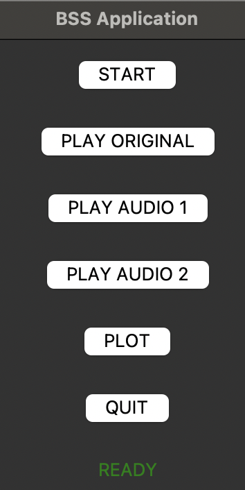

# RealTime_BlindSourceSeperation
Performing Real Time Blind Source Seperation (BSS) using Fast ICA and presenting it on an interactive GUI using Tkinter

Background:
BSS is a technique where you are able to seperate two distinct sounds without knowing any prior information about them or how they were mixed. A very important aaumption is that each source signal is statistically independent. This assumption is important for the following reasons as the algorithim that is used (Fast ICA) relies on this mathimatical propoerty in order to preform BSS. 

A very famous example of utilizing BSS would be the Cocktail Party example. In this example we are assuming that you have a close space where you have multiple people (distinct voices) speaking at the same time. In the room we have two microphones that are picking up the sound that is present. 

In this project we are prefroming Real-Time BSS where the input is processed in real time using an experimental microphone set up. The user will be able to perform such algorithim on an interactive GUI using Python's inbuilt library called Tkinter. On the GUI the user is able to play the original audio as well as the seperated sources after performing the Real-Time BSS. There is also a plotting function on the GUI that will show an interactive plot of the signals and how they were seperated. 

Below is a snip bit of the given program. 

There are two main files that make up this project. 

1) Wavefile Implementation
2) Real-Time/Microphones

Wavefile Implementation:
The first implementation takes in two wavefiles that contain a mixed signal of two distinct sounds. These wavefiles are recorded as two distinct voices that are mixed together. 
